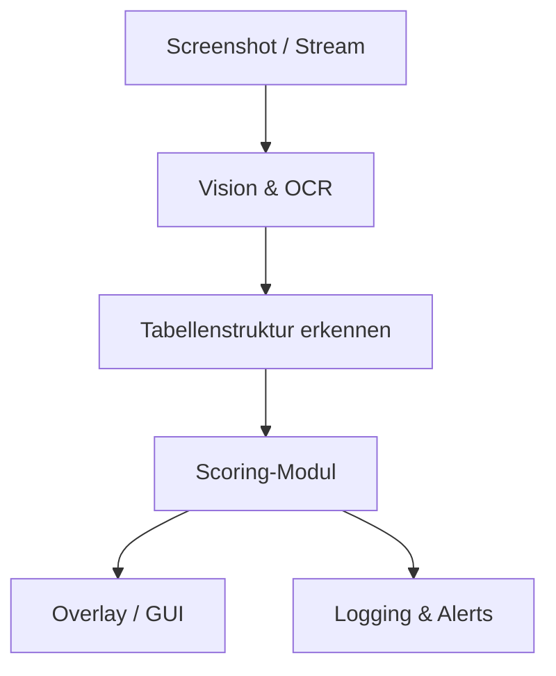

# 🧠 Architekturübersicht – Trading-Scanner Analyse

## 🎯 Ziel des Systems
Ein Tool zur Analyse von Screenshots eines Trading-Scanners (z. B. aus YouTube-Livestreams), um Kennzahlen wie ZENp, AtrVWAP etc. zu extrahieren, zu bewerten und visuell darzustellen.

## 📐 Architekturdiagramm (vereinfacht)

