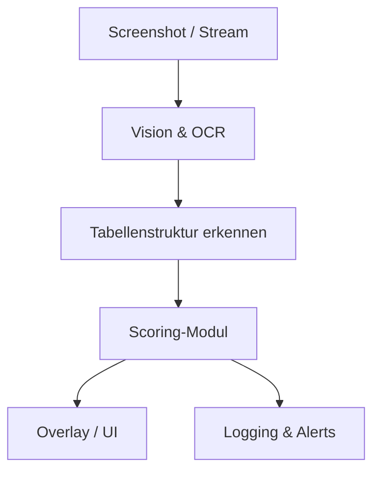

# 🧠 Architekturübersicht – Trading-Scanner Analyse

## 🎯 Ziel

Ein Tool zur Analyse von Screenshots eines Trading-Scanners, das technische Kennzahlen wie ZENp, AtrVWAP, AtrHoD etc. automatisch extrahiert, bewertet und visuell anzeigt.

## 📐 Architektur (vereinfacht)

